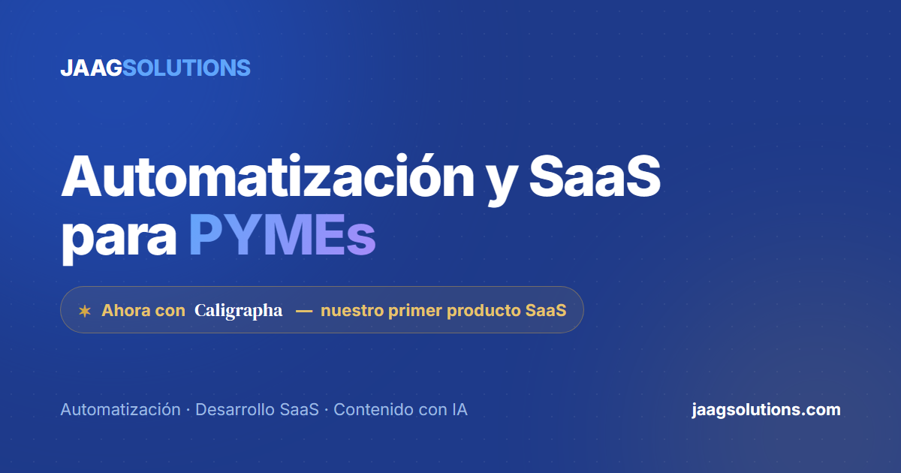
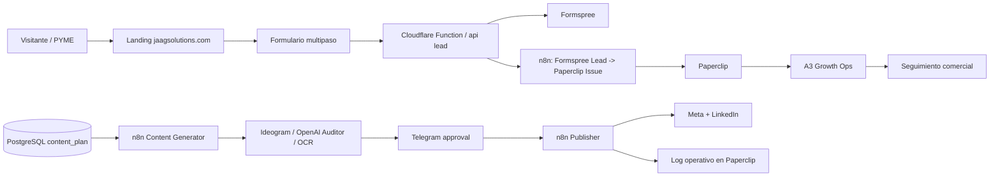
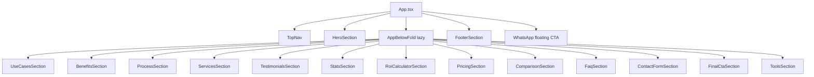
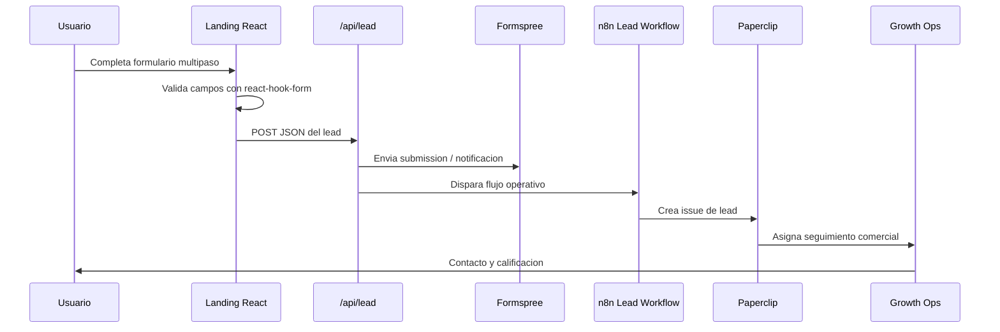
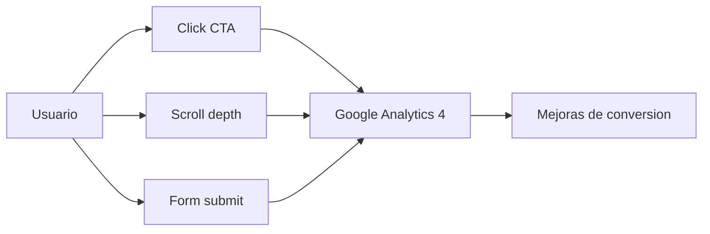
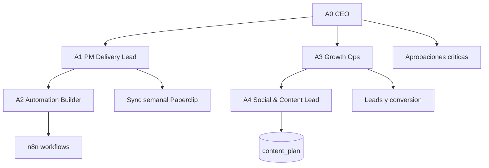
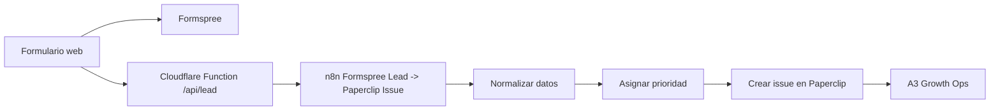
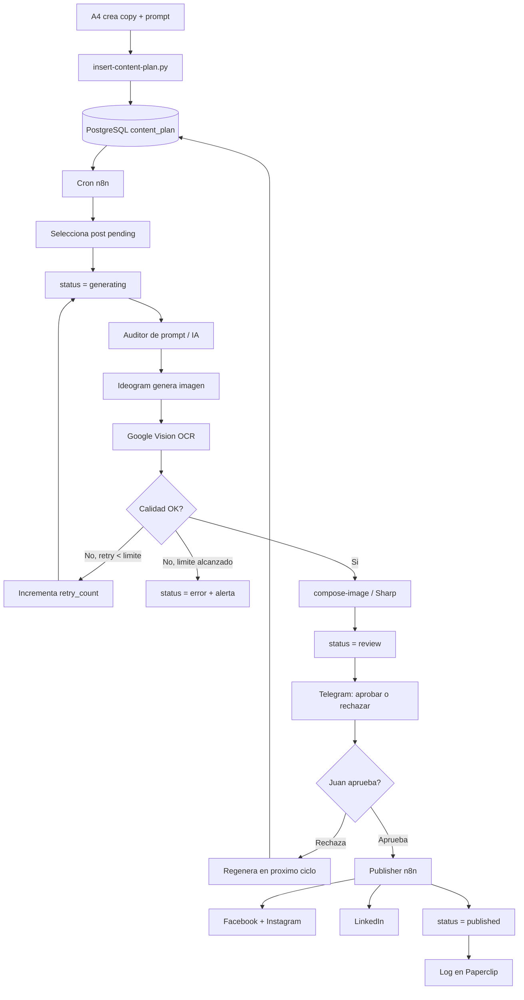
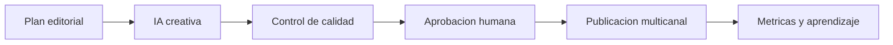
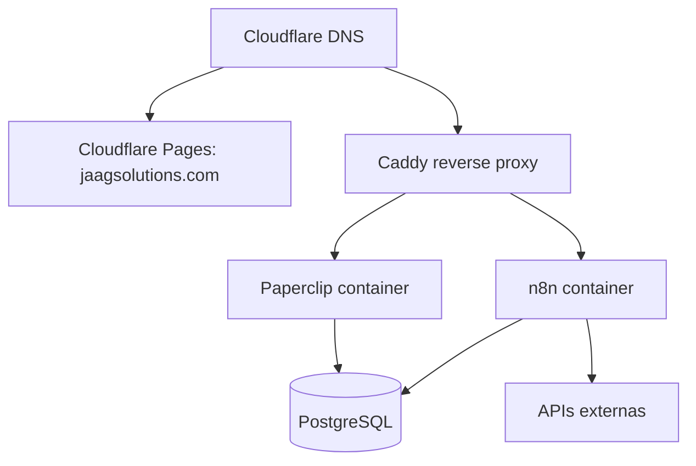

# JAAGSOLUTIONS - Guia de entrevista: stack tecnologico, arquitectura, web y automatizacion n8n

**Fecha:** 2026-06-11  
**Objetivo:** material de apoyo para explicar el proyecto JAAGSOLUTIONS ante audiencia ejecutiva y tecnica.  
**Nivel:** ejecutivo + tecnico.  
**Proyecto:** JAAGSOLUTIONS, agencia de automatizacion y SaaS para PYMEs.  

---

## 1. Resumen ejecutivo para abrir la entrevista

JAAGSOLUTIONS es un proyecto B2B creado para ayudar a PYMEs a reducir trabajo manual, mejorar velocidad operativa y escalar procesos con dos lineas de servicio:

1. **Automatizacion de flujos:** conectar herramientas existentes, reducir tareas repetitivas y crear procesos medibles.
2. **Desarrollo SaaS a medida:** construir plataformas operativas cuando el proceso ya esta validado y necesita control, roles, trazabilidad y crecimiento.

La solucion no es solo una pagina web. Es un sistema comercial y operativo compuesto por:

- Una **landing web** publica en `https://jaagsolutions.com`.
- Un **formulario de diagnostico** que captura leads calificados.
- Una **automatizacion n8n** que convierte leads en issues operativos dentro de Paperclip.
- Un **sistema de agentes** en Paperclip para coordinar ventas, delivery, contenido y control operativo.
- Un **pipeline automatizado de contenido** en n8n que genera, valida, aprueba y publica contenido en redes sociales con aprobacion humana por Telegram.

### Explicacion no tecnica

La web funciona como la vitrina comercial. El formulario no solo envia un correo: inicia un proceso interno. Cuando alguien solicita un diagnostico, el sistema crea una tarea comercial para que el equipo pueda responder, calificar y dar seguimiento.

El workflow de contenido funciona como una fabrica de publicaciones. El calendario editorial entra en una tabla, n8n toma el siguiente post, genera la imagen, valida calidad, pide aprobacion por Telegram y, si se aprueba, publica automaticamente en redes.

### Explicacion tecnica

La landing esta construida como una SPA/landing estatica con React, Vite, TypeScript y Tailwind CSS. El formulario usa `react-hook-form`, un endpoint `/api/lead` y Formspree/n8n como puente operativo. La infraestructura de operacion vive en un VPS con Docker Compose, PostgreSQL, Paperclip, n8n y Caddy como reverse proxy. El pipeline de contenido usa PostgreSQL como fuente de verdad (`content_plan`), workflows n8n exportados en JSON, APIs externas para generacion/OCR/publicacion y aprobacion humana via Telegram.

---

## 2. Elevator pitch de 60 segundos

> JAAGSOLUTIONS es una plataforma comercial y operativa para vender e implementar automatizaciones empresariales en PYMEs. Construimos una landing optimizada para conversion, conectada a un flujo de captura de leads que alimenta Paperclip, donde los agentes gestionan ventas, delivery y control. Ademas implementamos un pipeline de contenido en n8n que toma una agenda editorial desde PostgreSQL, genera piezas visuales con IA, valida la calidad con OCR, solicita aprobacion humana por Telegram y publica en Meta y LinkedIn. El resultado es un sistema que combina marketing, automatizacion, gobernanza y ejecucion tecnica en una operacion medible.

---

## 3. Elementos visuales incluidos en el proyecto

Estos activos ayudan a explicar el proyecto en una entrevista o presentacion.

### 3.1 Imagen principal del hero


**Como explicarla:** representa el concepto central del negocio: herramientas conectadas a un hub de automatizacion. Visualmente ayuda a decir que JAAGSOLUTIONS no vende "software aislado", sino sistemas conectados entre procesos, datos y personas.

### 3.2 Imagen Open Graph para compartir la web



**Como explicarla:** esta imagen se usa para previews sociales cuando alguien comparte el sitio. Forma parte del SEO social y de la consistencia de marca.

### 3.3 Video/asset del hero

El sitio tambien contiene un video visual para el hero:

```text
../jaagsolutions-web/public/hero-automation-hub.mp4
```

En visores Markdown que soportan HTML puede insertarse asi:

```html
<video src="../jaagsolutions-web/public/hero-automation-hub.mp4" controls width="720"></video>
```

### 3.4 Lead magnet

El formulario ofrece un recurso descargable:

```text
../jaagsolutions-web/public/5-flujos-clave-pymes.html
```

**Como explicarlo:** es un incentivo de conversion. El visitante deja datos de diagnostico y recibe un recurso de valor inmediato, mientras el equipo recibe informacion para calificar el lead.

---

## 4. Vista general de arquitectura



### Explicacion no tecnica

La arquitectura se divide en dos rutas:

- **Ruta de ventas:** persona entra a la web, completa diagnostico, y el sistema crea una oportunidad interna.
- **Ruta de contenido:** el equipo define una agenda y el sistema ayuda a producir y publicar contenido con supervision humana.

### Explicacion tecnica

La web es el frontend publico. La captura de leads pasa por una funcion/proxy y servicios externos. n8n actua como orquestador de eventos. Paperclip funciona como control plane operativo: company, agentes, goals, proyectos, issues y gobernanza. PostgreSQL mantiene la fuente de datos operativa para contenido y Paperclip.

---

## 5. Stack tecnologico de la pagina web

### 5.1 Resumen del stack implementado en `jaagsolutions-web`

La pagina web de JAAGSOLUTIONS fue construida como una landing comercial moderna, estatica, rapida y conectada a una operacion automatizada. No se eligio un constructor visual ni un CMS tradicional porque el objetivo no era solo publicar informacion: el objetivo era capturar leads, medir conversion, activar automatizaciones y dejar una base tecnica facil de escalar.

| Capa | Tecnologia implementada | Que es | Para que sirve en JAAGSOLUTIONS | Por que se eligio y no otra alternativa |
|---|---|---|---|---|
| Framework UI | React 18 | Libreria JavaScript para construir interfaces mediante componentes | Permite separar la landing en secciones reutilizables: hero, casos de uso, pricing, formulario, FAQ, CTA y herramientas | Se eligio sobre HTML estatico puro porque el sitio necesitaba interactividad, estado, formulario multipaso, lazy loading y componentes reutilizables. Se eligio sobre WordPress porque se buscaba menos mantenimiento, mas performance y mayor control tecnico |
| Build tool | Vite 6 | Herramienta de desarrollo y empaquetado frontend | Sirve para correr el sitio en local, compilar TypeScript/React y generar archivos optimizados para produccion | Se eligio sobre Create React App porque Vite es mas rapido y moderno. Se eligio sobre Webpack manual porque reduce configuracion y complejidad. No se uso Next.js porque no se necesitaba SSR ni backend full-stack para esta fase |
| Lenguaje | TypeScript 5 | JavaScript con sistema de tipos | Ayuda a validar props, estados, payload del formulario, helpers de analytics y configuracion antes del deploy | Se eligio sobre JavaScript puro porque reduce errores silenciosos y mejora mantenibilidad. En un proyecto con formularios, eventos y automatizaciones, el tipado baja el riesgo operativo |
| Estilos | Tailwind CSS 3 | Framework CSS utility-first | Define layout, colores, responsive, espaciado, estados visuales, animaciones y consistencia UI | Se eligio sobre CSS tradicional porque acelera iteracion sin crear muchas clases manuales. Se eligio sobre Bootstrap porque JAAGSOLUTIONS necesitaba identidad visual propia, no apariencia generica. Se eligio sobre Material UI porque no se queria una app con look de dashboard corporativo estandar |
| Iconografia | lucide-react | Libreria de iconos SVG para React | Comunica visualmente beneficios, servicios, herramientas y acciones sin sobrecargar texto | Se eligio sobre iconos dibujados a mano para mantener consistencia. Se eligio sobre Font Awesome porque lucide es mas limpio, ligero y encaja mejor con una estetica B2B moderna |
| Formularios | react-hook-form | Libreria para manejar formularios y validacion en React | Gestiona el formulario multipaso de diagnostico: campos obligatorios, errores, estado de envio, reset y submit | Se eligio sobre manejar todo con `useState` manual porque el formulario tiene muchos campos y validaciones. Se eligio sobre Formik porque react-hook-form es mas ligero y tiene mejor rendimiento para formularios grandes |
| Lead routing | Cloudflare Function `/api/lead` | Funcion serverless/proxy en el borde | Recibe el formulario y enruta el lead hacia Formspree/n8n sin exponer detalles sensibles en el frontend | Se eligio sobre enviar directo desde el navegador porque permite control, antispam, validacion y futura evolucion. No se construyo un backend propio porque para esta fase era mas eficiente una funcion serverless |
| Backend de formulario | Formspree | Servicio SaaS para recibir submissions de formularios | Recibe y notifica solicitudes comerciales; actua como respaldo operativo del formulario | Se eligio sobre construir un modulo de email propio porque acelera salida a produccion. Se mantiene n8n como capa operativa para que el lead no quede solo como correo |
| Analytics | Google Analytics 4 via `gtag` | Herramienta de medicion web | Mide conversiones, clicks en CTA y profundidad de scroll | Se eligio sobre no medir porque una landing B2B debe optimizarse con datos. Se eligio sobre herramientas mas pesadas como Mixpanel porque GA4 cubre lo necesario para el MVP sin costo adicional |
| Hosting frontend | Cloudflare Pages | Plataforma de hosting estatico con CDN y SSL | Publica `jaagsolutions.com` con despliegues por Git, HTTPS y distribucion global | Se eligio sobre servidor VPS para la landing porque un sitio estatico es mas rapido y barato en CDN. Se evaluo Vercel como opcion inicial, pero la produccion real quedo en Cloudflare Pages por integracion con DNS, dominio y edge functions |
| Automatizacion | n8n | Plataforma de automatizacion por workflows | Conecta formulario, Paperclip, contenido, Telegram y APIs externas | Se eligio sobre Zapier/Make porque n8n permite self-hosting, mas control, versionado de workflows y menor dependencia operativa a largo plazo |
| Control operativo | Paperclip | Sistema para gestionar company, agents, goals, projects e issues | Convierte leads y tareas internas en trabajo trazable con responsables | Se eligio sobre una simple hoja de calculo o Trello porque se necesitaba estructura de agentes, objetivos, presupuestos, aprobaciones e historial operativo |
| Base de datos operativa | PostgreSQL | Base de datos relacional | Guarda datos de Paperclip y la tabla `content_plan` del pipeline de contenido | Se eligio sobre archivos JSON/CSV porque el pipeline requiere estados, consultas, reintentos, auditoria e integridad. Se eligio sobre una base NoSQL porque el modelo es relacional y transaccional |

### 5.2 Dependencias principales reales

Archivo de referencia:

```text
jaagsolutions-web/package.json
```

Dependencias runtime:

```text
react
react-dom
react-hook-form
lucide-react
```

Dependencias de desarrollo:

```text
vite
@vitejs/plugin-react
typescript
tailwindcss
postcss
autoprefixer
```

### 5.3 Explicacion por tecnologia: que es, para que sirve y por que se uso

#### React 18

**Que es:** React es una libreria de JavaScript para crear interfaces de usuario usando componentes. Un componente es una pieza de interfaz que combina estructura, logica y apariencia.

**Para que sirve en JAAGSOLUTIONS:** permite construir la web como bloques independientes: `TopNav`, `HeroSection`, `UseCasesSection`, `ContactFormSection`, `FaqSection`, `FooterSection`, entre otros.

**Por que se implemento:** el sitio no era una pagina informativa simple. Necesitaba formulario multipaso, estados de exito/error, calculadora ROI, accordions, tracking de eventos, WhatsApp flotante y carga diferida. React resuelve bien esas necesidades.

**Por que no HTML/CSS/JS puro:** se podia hacer, pero al crecer el sitio se volveria mas dificil mantener la logica de estado y la reutilizacion de componentes.

**Por que no WordPress/Wix/Framer:** esas opciones aceleran paginas simples, pero agregan dependencia de plataforma y menos control sobre integraciones, build, payload del formulario, tracking y arquitectura de automatizacion.

**Para ejecutivos:** React permite construir una experiencia moderna y flexible, con secciones que se pueden mejorar sin rehacer todo el sitio.

**Para tecnicos:** la landing se divide en componentes y secciones. Esto mejora mantenibilidad, reutilizacion y separacion de responsabilidades. El sitio usa `lazy` y `Suspense` para cargar el contenido bajo el pliegue en un chunk asincrono y reducir el JavaScript inicial.

Ejemplo real de arquitectura:

```text
App.tsx
  TopNav
  HeroSection
  Suspense -> AppBelowFold
  FooterSection
  WhatsApp floating CTA
```

#### Vite 6

**Que es:** Vite es una herramienta para desarrollar y compilar aplicaciones web modernas.

**Para ejecutivos:** Vite acelera el ciclo de desarrollo y produce archivos estaticos optimizados para produccion.

**Para tecnicos:** Vite provee dev server con HMR y build de produccion. En este proyecto permite una landing independiente, sin acoplarla al monorepo principal de Paperclip.

**Por que se implemento:** permite desarrollar rapido, compilar React/TypeScript y generar el directorio `dist` que Cloudflare Pages publica.

**Por que no Create React App:** Create React App quedo como una opcion menos moderna y mas pesada para este tipo de proyecto.

**Por que no Next.js:** Next.js es muy potente, pero para esta fase no hacia falta server-side rendering, rutas complejas ni API backend full-stack. La landing podia resolverse mejor como sitio estatico con funciones ligeras.

#### TypeScript 5

**Que es:** TypeScript es JavaScript con tipos. Permite declarar la forma esperada de datos, propiedades y funciones.

**Para ejecutivos:** TypeScript reduce riesgos porque detecta errores antes del deploy.

**Para tecnicos:** el formulario, props de componentes y helpers de analytics se benefician de tipos. Esto ayuda a evitar errores de payload, eventos y estados.

**Por que se implemento:** el proyecto conecta formulario, eventos de analytics y automatizaciones. Un error de nombre de campo o tipo de dato puede romper el flujo comercial. TypeScript ayuda a detectar esos errores durante desarrollo.

**Por que no JavaScript puro:** JavaScript puro es mas flexible, pero esa flexibilidad tambien permite errores que aparecen tarde. TypeScript da mayor disciplina tecnica sin cambiar el runtime del navegador.

#### Tailwind CSS 3

**Que es:** Tailwind CSS es un framework de estilos basado en clases utilitarias. En vez de crear una clase CSS por componente, se combinan utilidades para espaciado, color, tamanos, grids, estados y responsive.

**Para ejecutivos:** Tailwind acelera cambios visuales sin perder consistencia.

**Para tecnicos:** usa clases utilitarias para layout, espaciado, responsive, colores, estados y animaciones. Permite construir componentes sin escribir CSS personalizado excesivo.

**Por que se implemento:** la landing necesitaba muchas secciones visuales, responsive, tarjetas, CTAs, formularios, modales y fondos. Tailwind permite crear todo eso de forma consistente y rapida.

**Por que no Bootstrap:** Bootstrap acelera prototipos, pero tiende a una apariencia reconocible y generica. JAAGSOLUTIONS necesitaba una identidad B2B propia.

**Por que no CSS tradicional solamente:** CSS manual funciona, pero en un sitio con muchas secciones aumenta la cantidad de clases, archivos y riesgo de inconsistencias.

#### lucide-react

**Que es:** lucide-react es una libreria de iconos SVG para React.

**Para que sirve:** mejora la comunicacion visual en beneficios, servicios, acciones, navegacion y secciones de herramientas.

**Por que se implemento:** los iconos ayudan a explicar conceptos de negocio sin sobrecargar el texto. Tambien hacen que la pagina se vea mas profesional y escaneable.

**Por que no iconos manuales:** dibujar iconos uno por uno consume tiempo y genera inconsistencia visual.

#### react-hook-form

**Que es:** es una libreria para manejar formularios en React con validacion, errores y estado de envio.

**Para que sirve:** controla el formulario multipaso de diagnostico, valida campos obligatorios, maneja el submit y permite mostrar errores claros.

**Por que se implemento:** el formulario tiene varios pasos y campos. Hacerlo manualmente con muchos `useState` aumentaria complejidad y probabilidad de errores.

**Por que no un formulario simple de HTML:** se necesitaban pasos, validaciones dinamicas, estado de exito, honeypot antispam, descarga de PDF y tracking de conversion.

#### Cloudflare Pages y Cloudflare Function

**Que es:** Cloudflare Pages publica sitios estaticos en una red global. Cloudflare Functions permite ejecutar pequenas funciones serverless cerca del usuario.

**Para que sirve:** Pages sirve la landing; la funcion `/api/lead` actua como punto controlado para procesar el formulario.

**Por que se implemento:** el sitio necesitaba velocidad, SSL, despliegue simple por Git y una funcion ligera para manejar leads sin montar un backend completo.

**Por que no alojar la landing en el VPS:** el VPS esta mejor reservado para servicios vivos como Paperclip, n8n y PostgreSQL. La landing estatica es mas eficiente en CDN.

#### n8n

**Que es:** n8n es una plataforma de automatizacion de workflows. Permite conectar servicios, APIs, bases de datos y acciones con nodos visuales.

**Para que sirve:** orquesta el flujo de leads y el pipeline de contenido. Conecta Formspree, Paperclip, PostgreSQL, Telegram, Meta, LinkedIn, Ideogram y Google Vision.

**Por que se implemento:** JAAGSOLUTIONS vende automatizacion; usar n8n permite demostrar el servicio con la propia operacion del proyecto. Ademas permite cambios mas rapidos que programar cada integracion desde cero.

**Por que no Zapier o Make:** Zapier/Make son buenos para automatizaciones simples, pero n8n ofrece self-hosting, mayor control, workflows versionables y mejor ajuste para una operacion tecnica propia.

#### Paperclip

**Que es:** Paperclip es el sistema operativo interno donde se modelan empresas, agentes, objetivos, proyectos e issues.

**Para que sirve:** convierte la actividad comercial y tecnica en trabajo trazable. Un lead no queda solo como correo: se convierte en issue con responsable, proyecto, prioridad y seguimiento.

**Por que se implemento:** el proyecto necesitaba gobernanza, agentes, presupuestos, aprobaciones y sincronizacion operativa. Una hoja de calculo o tablero simple no daba ese nivel de estructura.

#### PostgreSQL

**Que es:** PostgreSQL es una base de datos relacional.

**Para que sirve:** guarda datos de Paperclip y administra `content_plan`, la tabla que agenda y controla estados del pipeline de contenido.

**Por que se implemento:** el pipeline necesita consultas confiables, estados, reintentos, timestamps, indices y consistencia. PostgreSQL es adecuado para datos estructurados y procesos con trazabilidad.

**Por que no CSV/Google Sheets como fuente principal:** una hoja puede servir para estrategia o carga inicial, pero no como fuente operacional robusta para cron, estados, errores, reintentos y auditoria.

### 5.4 Como resumir la decision tecnica en entrevista

> Elegimos un stack moderno y ligero porque la necesidad no era solo publicar una web, sino crear una experiencia comercial medible y conectada a una operacion automatizada. React y Vite nos dan velocidad y modularidad; TypeScript reduce errores; Tailwind acelera diseno consistente; Cloudflare Pages entrega performance y SSL; n8n conecta los procesos; Paperclip convierte eventos en trabajo operativo; y PostgreSQL mantiene la fuente de verdad del contenido y de la operacion.

### 5.5 Decisiones que NO se tomaron y por que

| Alternativa no elegida | Por que no fue la mejor opcion para este proyecto |
|---|---|
| WordPress | Bueno para contenido administrable, pero agrega mantenimiento, plugins, seguridad y menos control para integraciones a medida |
| Wix / Webflow / Framer | Utiles para landing visual rapida, pero menos adecuados para controlar flujo de datos, tracking y automatizacion operativa propia |
| HTML/CSS/JS puro | Adecuado para algo pequeno, pero menos mantenible al crecer a formulario multipaso, calculadora, analytics y muchas secciones |
| Next.js | Excelente para apps full-stack o SSR, pero innecesario para una landing estatica con funciones ligeras |
| Backend propio completo | No era necesario en MVP; una funcion serverless + n8n resolvian el flujo con menos costo y menos mantenimiento |
| Zapier / Make | Rapidos para automatizar, pero n8n da mas control, self-hosting y versionado de workflows |
| Google Sheets como base operacional | Facil de usar, pero debil como fuente transaccional para estados, reintentos, logs y cron |

---

## 6. Estructura real de la web

La landing evoluciono desde el MVP inicial. La version real tiene mas secciones para conversion, confianza y demostracion tecnica.



### Orden narrativo de la pagina

1. **Hero:** promesa principal: liberar al equipo de tareas manuales.
2. **Casos de uso:** el visitante ve si el servicio aplica a su negocio.
3. **Beneficios:** menos trabajo manual, menos errores, mas velocidad y mejor control.
4. **Proceso:** analizamos, implementamos y optimizamos.
5. **Servicios:** automatizacion de flujos y SaaS para PYMEs.
6. **Testimonios:** validacion social y confianza.
7. **Stats:** numeros y credibilidad.
8. **Calculadora ROI:** convierte el dolor en impacto economico.
9. **Pricing:** paquetes orientativos.
10. **Comparativa:** automatizacion vs SaaS.
11. **FAQ:** objeciones frecuentes.
12. **Formulario:** conversion principal.
13. **CTA final:** cierre comercial.
14. **Tools:** credencial tecnica del stack habitual.

### Decisiones de UX destacables

- **Formulario multipaso:** reduce intimidacion y mejora calidad del lead.
- **WhatsApp flotante:** permite contacto rapido para Venezuela y Chile.
- **Lead magnet:** entrega valor inmediato despues del submit.
- **Lazy loading:** mejora rendimiento inicial.
- **Scroll depth analytics:** mide interes real por seccion.
- **CTA repetidos:** guian al usuario en momentos de decision.

---

## 7. Formulario de diagnostico y conversion



### Campos principales del formulario

El formulario real captura:

- Nombre
- Email
- Empresa
- Sitio web
- Tamano del equipo
- Dolor o proceso principal
- Herramientas actuales
- Presupuesto estimado
- Urgencia o timeline
- WhatsApp
- Solicitud de recurso PDF
- Diagnostico express opcional
- Honeypot `_hp` antispam

### Explicacion no tecnica

El formulario no pregunta solo "nombre y correo". Captura contexto: tamano, problema, herramientas, urgencia y presupuesto. Eso permite que la primera conversacion sea mas util y que el equipo no pierda tiempo con leads sin contexto.

### Explicacion tecnica

`react-hook-form` valida los pasos obligatorios. En produccion, el submit exige `VITE_FORMSPREE_ID`. El payload se envia a `/api/lead`, que evita exponer detalles sensibles del flujo y permite enrutar el lead hacia Formspree/n8n/Paperclip. El formulario tambien registra `form_submit` en GA4 cuando `VITE_GA_ID` esta configurado.

---

## 8. SEO, performance y medicion

### SEO

La web define:

- Title y meta description.
- Open Graph tags.
- `robots.txt`.
- `sitemap.xml`.
- Imagen social `og-share.png`.
- Contenido indexable en secciones.

### Performance

Decisiones implementadas:

- Build estatico con Vite.
- Carga diferida de secciones bajo el pliegue con `lazy` y `Suspense`.
- Assets publicos optimizados.
- Hosting en CDN via Cloudflare Pages.

### Analytics

Eventos implementados:

- `form_submit`: envio de formulario.
- `cta_click`: clicks en CTA.
- `scroll_depth`: avance 25%, 50%, 75%, 100%.



### Como defenderlo en entrevista

**Ejecutivo:** no basta con publicar una web; hay que medir si convierte. Por eso se instrumentaron eventos y profundidad de scroll.

**Tecnico:** se implemento un wrapper `trackEvent` que llama `gtag` solo si existe en `window`, evitando errores si GA no esta cargado.

---

## 9. Paperclip como capa operativa

Paperclip funciona como el control plane interno de JAAGSOLUTIONS.

### Que representa Paperclip

| Elemento | Significado ejecutivo | Significado tecnico |
|---|---|---|
| Company | La organizacion JAAGSOLUTIONS | Entidad raiz del modelo |
| Goals | Objetivos de negocio | Jerarquia de metas |
| Agents | Roles operativos | Actores con capacidades y presupuestos |
| Projects | Frentes de trabajo | Agrupacion de issues |
| Issues | Tareas accionables | Unidad de ejecucion y seguimiento |
| Budgets | Control de gasto | Limites operativos por agente |
| Approvals | Gobernanza | Control humano para acciones criticas |

### Seed de JAAGSOLUTIONS

La fuente de verdad es:

```text
Proyect_JAAGSOLUTIONS/jaagsolutions-seed.json
```

Estado operativo reconocido:

- 5 agentes.
- 6 goals.
- 4 proyectos.
- 21 issues.
- Proyecto P4: `Content Automation Production Ops`.
- A4: `Social & Content Lead`.

### Agentes

| Agente | Rol | Responsabilidad |
|---|---|---|
| A0 CEO JAAGSOLUTIONS | Gobernanza | Aprueba cambios criticos, presupuesto, pricing y promesas comerciales |
| A1 PM Delivery Lead | Operacion | Sincroniza Paperclip, coordina tareas y controla evidencia |
| A2 Automation Builder | Tecnico | Mantiene n8n, credenciales, webhooks, OCR y despliegues |
| A3 Growth Ops | Comercial | Mide leads, conversion y aprendizaje comercial |
| A4 Social & Content Lead | Contenido | Opera calendario editorial dentro del workflow aprobado |

### Diagrama operativo de agentes



---

## 10. n8n: automatizacion de leads

### Objetivo

Convertir solicitudes del sitio en trabajo comercial accionable.

### Flujo



### Explicacion no tecnica

Cada formulario se convierte en una tarea comercial. Asi el lead no queda perdido en una bandeja de correo. El equipo puede ver quien llego, que necesita, que urgencia tiene y que accion sigue.

### Explicacion tecnica

El workflow `formspree-to-paperclip.json` recibe datos del lead, transforma el payload y llama a la API de Paperclip para crear un issue asociado a:

- Company JAAGSOLUTIONS.
- Proyecto P2 Demand Engine.
- Goal G2.
- Agente A3 Growth Ops.

### Resultado

El sistema conecta marketing con operacion. Esto es clave porque evita la ruptura tipica entre "alguien lleno un formulario" y "alguien le dio seguimiento".

---

## 11. n8n: pipeline automatizado de contenido

### Objetivo

Crear una fabrica de contenido automatizada que publique en redes sin perder control humano.

### Fuente de verdad

Regla principal:

```text
Si no esta en content_plan, no esta agendado.
```

La tabla `content_plan` en PostgreSQL es la unica fuente operacional para publicaciones futuras.

### Workflows oficiales

| Workflow | Archivo | Rol |
|---|---|---|
| Content Generator | `deploy/n8n-workflows/content-generator.json` | Lee `content_plan`, genera imagen, valida y envia a Telegram |
| Telegram Approval -> Publisher | `deploy/n8n-workflows/telegram-approval.json` | Recibe aprobacion o rechazo, publica y actualiza estado |
| Formspree Lead -> Paperclip Issue | `deploy/n8n-workflows/formspree-to-paperclip.json` | Convierte leads en issues operativos |

### Diagrama completo del pipeline



### Estados del contenido

| Estado | Significado |
|---|---|
| `pending` | Pendiente para que el cron lo tome |
| `generating` | En proceso de generacion |
| `review` | Listo para aprobacion humana en Telegram |
| `approved` | Aprobado, listo para publicar |
| `published` | Publicado |
| `error` | Fallo que requiere intervencion |

### Modelo de datos principal

Tabla:

```text
deploy/sql/content-plan-schema.sql
```

Campos clave:

- `scheduled_date`
- `scheduled_time`
- `platform`
- `format`
- `pillar`
- `post_type`
- `copy_text`
- `image_prompt`
- `hashtags`
- `cta_url`
- `image_url`
- `status`
- `retry_count`
- `telegram_msg_id`
- `published_at`
- `error_log`

### Consulta usada por el cron

```sql
SELECT *
FROM content_plan
WHERE status = 'pending'
AND scheduled_date BETWEEN CURRENT_DATE AND CURRENT_DATE + 2
ORDER BY scheduled_date, scheduled_time
LIMIT 1;
```

### Explicacion no tecnica

El sistema revisa que publicaciones estan pendientes, prepara el material, genera la imagen, la revisa, se la muestra a una persona por Telegram y solo publica cuando alguien aprueba. Si algo sale mal, no fuerza la publicacion: lo marca para revision.

### Explicacion tecnica

n8n orquesta nodos de PostgreSQL, HTTP Request, Code, Telegram y APIs sociales. La tabla `content_plan` evita calendarios paralelos. Los estados permiten trazabilidad, reintentos y recuperacion. La aprobacion por Telegram mantiene human-in-the-loop antes de publicar.

### Valor de negocio

- Reduce trabajo manual de contenido.
- Mantiene consistencia editorial.
- Evita publicar sin supervision.
- Centraliza estado y auditoria.
- Convierte marketing en una operacion repetible.

---

## 12. Content Automation Engine como producto comercial

El pipeline de contenido no solo es una automatizacion interna. Puede presentarse como producto:

> De un plan editorial a publicaciones listas en LinkedIn, Instagram y Facebook, con IA, aprobacion humana y distribucion automatica.

### Narrativa comercial



### Como explicarlo a ejecutivos

Muchas empresas quieren publicar contenido constante, pero dependen de tareas manuales: preparar ideas, generar imagenes, revisar, copiar en cada red y publicar. El Content Automation Engine convierte ese proceso en una linea de produccion con aprobacion humana.

### Como explicarlo a tecnicos

El producto usa:

- PostgreSQL para agenda y estado.
- n8n para orquestacion.
- APIs de IA/imagen para generacion.
- OCR para validacion defensiva.
- Telegram Bot API para aprobacion.
- Meta Graph API y LinkedIn API para publicacion.
- Paperclip para registro operativo y gobierno.

---

## 13. Infraestructura de produccion

### Estado reconocido

| Servicio | URL | Estado |
|---|---|---|
| Landing web | `https://jaagsolutions.com` | Live |
| Paperclip | `https://paperclip.jaagsolutions.com` | Live |
| n8n | `https://n8n.jaagsolutions.com` | Live |
| Workflow leads | Formspree Lead -> Paperclip Issue | Activo |
| Workflow contenido | Content Generator -> Telegram Approval -> Meta + LinkedIn | Activo / operacion continua |

### Componentes de infraestructura



### Archivos de infraestructura

| Archivo | Proposito |
|---|---|
| `deploy/docker-compose.yml` | Levanta Paperclip, PostgreSQL, n8n y Caddy |
| `deploy/Caddyfile` | Reverse proxy y SSL |
| `deploy/setup.sh` | Bootstrap del VPS |
| `deploy/RUNBOOK.md` | Operacion y recuperacion |
| `deploy/sql/content-plan-schema.sql` | Schema de contenido |
| `deploy/scripts/insert-content-plan.py` | Insercion de publicaciones |
| `deploy/n8n-workflows/*.json` | Workflows n8n versionados |

### Por que Docker Compose

**Ejecutivo:** facilita operar varios servicios con una configuracion repetible.

**Tecnico:** define servicios, redes, volumenes y variables de entorno en un solo punto. Permite reiniciar o actualizar n8n/Paperclip/PostgreSQL/Caddy con comandos controlados.

### Por que Caddy

**Ejecutivo:** da HTTPS y acceso seguro a servicios internos.

**Tecnico:** funciona como reverse proxy con SSL automatico y rutas por subdominio.

---

## 14. Seguridad y gobernanza

### Principios

- No exponer PostgreSQL publicamente.
- Usar HTTPS para servicios publicos.
- Guardar secretos en variables de entorno.
- Mantener aprobacion humana para acciones criticas.
- No publicar contenido sin Telegram approval.
- No cambiar workflows activos sin rollback.
- No usar calendarios paralelos fuera de `content_plan`.

### Aprobaciones humanas obligatorias

- Cambios en produccion de clientes.
- Rotacion o uso de credenciales.
- Envio de propuesta economica final.
- Cambios de pricing o alcance contractual.
- Publicacion de contenido a redes.

### Riesgos mitigados

| Riesgo | Mitigacion |
|---|---|
| Leads perdidos en email | Workflow crea issue en Paperclip |
| Spam en formulario | Honeypot `_hp` y validaciones |
| Publicacion incorrecta | Telegram approval |
| Imagen con texto no deseado | OCR + retry/error |
| Calendarios duplicados | `content_plan` como fuente unica |
| Cambios n8n no reproducibles | JSON versionado en repo |
| Credenciales no portables | Runbook de import con IDs reales |

---

## 15. Roadmap y evolucion del proyecto

### Fase 1: Presencia comercial

- Landing completa.
- Formulario multipaso.
- SEO base.
- Dominio y SSL.
- GA4.
- Lead magnet.
- WhatsApp y email visible.

### Fase 2: Operacion de leads

- Formulario conectado a n8n.
- Issues en Paperclip.
- A3 Growth Ops como responsable.
- Seguimiento comercial y calificacion.

### Fase 3: Contenido automatizado

- `content_plan` como agenda editorial.
- n8n Content Generator.
- Ideogram/OCR/Telegram.
- Publicacion Meta + LinkedIn.
- Reporte semanal de contenido/leads.

### Fase 4: Escalamiento

- Alertas si no hay publicaciones futuras.
- Mayor variedad visual por memoria historica.
- Mejor enriquecimiento de prompts de A4.
- LinkedIn organizacion, si aplica.
- Dashboard comercial con leads, conversion y contenido.
- PDF dinamico o diagnostico personalizado con IA.

---

## 16. Preguntas dificiles y respuestas preparadas

### Pregunta: Por que no usaste WordPress?

**Respuesta ejecutiva:** porque el proyecto necesitaba mas que una web editable. Necesitaba performance, control tecnico, integracion con automatizaciones y capacidad de evolucionar como producto.

**Respuesta tecnica:** React + Vite permite un frontend estatico muy rapido, con control sobre componentes, eventos, formulario, assets, build y despliegue. WordPress habria agregado superficie de mantenimiento que no era necesaria para esta fase.

### Pregunta: Por que n8n?

**Respuesta ejecutiva:** porque permite automatizar procesos de negocio sin construir todo desde cero, manteniendo visibilidad del flujo.

**Respuesta tecnica:** n8n es adecuado para orquestar APIs, webhooks, transformaciones, aprobaciones y acciones multi-sistema. Tambien facilita versionar workflows exportados como JSON y operarlos en self-hosting.

### Pregunta: Por que mantener aprobacion humana si el objetivo es automatizar?

**Respuesta ejecutiva:** porque automatizar no significa perder control. Para contenido y cambios criticos, la aprobacion humana reduce riesgo de marca y errores.

**Respuesta tecnica:** el pipeline implementa human-in-the-loop por Telegram. El estado `review` separa generacion de publicacion.

### Pregunta: Como sabes si la web funciona?

**Respuesta ejecutiva:** midiendo conversiones, clicks en CTA, scroll y leads calificados.

**Respuesta tecnica:** GA4 recibe eventos `form_submit`, `cta_click` y `scroll_depth`. El sistema tambien puede validarse E2E desde formulario hasta issue en Paperclip.

### Pregunta: Como evitas que el contenido se publique mal?

**Respuesta ejecutiva:** con revision automatica y aprobacion humana.

**Respuesta tecnica:** el flujo usa OCR, reintentos, estados `error/review/published`, y Telegram approval antes de publicar.

### Pregunta: Cual es el mayor aprendizaje del proyecto?

El aprendizaje principal es que una web B2B moderna no debe ser solo una pagina bonita. Debe conectar marketing, datos, automatizacion, seguimiento y operacion. El valor esta en convertir interacciones digitales en procesos medibles.

---

## 17. Guion para explicar a area ejecutiva

### 17.1 Problema

Muchas PYMEs operan con procesos manuales: WhatsApp, Excel, correos, seguimientos dispersos y baja visibilidad. Eso genera errores, retrasos y perdida de oportunidades.

### 17.2 Solucion

JAAGSOLUTIONS ofrece automatizaciones y SaaS para ordenar procesos. La propia operacion del proyecto demuestra esa propuesta: la web capta leads, n8n los procesa, Paperclip los convierte en tareas, y los agentes mantienen seguimiento.

### 17.3 Diferenciador

No se vende tecnologia por tecnologia. Se vende una ruta: diagnostico, implementacion, medicion y mejora continua.

### 17.4 Impacto esperado

- Menos tareas manuales.
- Mejor tiempo de respuesta.
- Menos errores.
- Mayor trazabilidad.
- Mejor conversion comercial.
- Contenido publicado de forma constante con control humano.

---

## 18. Guion para explicar a area tecnica

### 18.1 Frontend

La web esta construida con React 18, Vite 6, TypeScript 5 y Tailwind CSS. Es una landing estatica desplegada en Cloudflare Pages, con componentes modulares, lazy loading y analytics.

### 18.2 Captura de leads

El formulario usa `react-hook-form`, validacion multipaso, honeypot antispam y envio por `/api/lead`. El payload se enruta a Formspree/n8n, y n8n crea issues en Paperclip.

### 18.3 Operacion

Paperclip centraliza company, agents, goals, projects e issues. La estructura se carga con un seed JSON versionado. Los agentes tienen roles y governance.

### 18.4 Automatizacion de contenido

n8n lee `content_plan`, genera imagen, valida con OCR, envia a Telegram para aprobacion y publica en Meta/LinkedIn. Todo queda trazado por estado en PostgreSQL.

### 18.5 Infraestructura

Cloudflare Pages sirve la landing. El VPS ejecuta Docker Compose con Paperclip, PostgreSQL, n8n y Caddy. Los workflows se versionan en `deploy/n8n-workflows`.

---

## 19. Mini presentacion para entrevista

### Slide 1 - Titulo

**JAAGSOLUTIONS: automatizacion y SaaS para PYMEs**  
Subtitulo: de una landing comercial a una operacion automatizada de leads y contenido.

### Slide 2 - Problema

Las PYMEs pierden tiempo y oportunidades por procesos manuales, herramientas desconectadas y seguimiento inconsistente.

### Slide 3 - Propuesta de valor

Automatizamos procesos, conectamos herramientas y construimos SaaS cuando el negocio necesita escalar con control.

### Slide 4 - Web comercial

Landing en React + Vite + TypeScript + Tailwind, optimizada para conversion B2B, SEO, analytics y formulario multipaso.

### Slide 5 - Arquitectura de leads

Formulario -> Cloudflare Function -> Formspree/n8n -> Paperclip issue -> Growth Ops.

### Slide 6 - Paperclip como sistema operativo

Company, goals, agentes, proyectos, issues, presupuestos y aprobaciones.

### Slide 7 - Pipeline de contenido n8n

`content_plan` -> generacion -> OCR -> Telegram approval -> Meta + LinkedIn -> reporte.

### Slide 8 - Human-in-the-loop

Automatizacion con control humano: nada se publica sin aprobacion.

### Slide 9 - Infraestructura

Cloudflare Pages para web; VPS con Docker Compose, n8n, Paperclip, PostgreSQL y Caddy.

### Slide 10 - Seguridad y gobernanza

Secretos por entorno, PostgreSQL no expuesto, HTTPS, aprobaciones, workflows versionados y runbook operativo.

### Slide 11 - Resultados

Landing live, pipeline de leads activo, pipeline de contenido E2E validado, roles operativos definidos.

### Slide 12 - Cierre

JAAGSOLUTIONS demuestra la misma promesa que vende: convertir procesos manuales en sistemas medibles, automatizados y gobernados.

---

## 20. Checklist rapido antes de la entrevista

- [ ] Tener abierta la landing: `https://jaagsolutions.com`.
- [ ] Tener preparada una captura del formulario multipaso.
- [ ] Mostrar el diagrama de arquitectura general.
- [ ] Explicar la diferencia entre automatizacion y SaaS.
- [ ] Tener listo el ejemplo del lead que se convierte en issue.
- [ ] Tener listo el ejemplo del pipeline de contenido con Telegram approval.
- [ ] Evitar decir "todo lo hace la IA"; decir "automatizacion con control humano".
- [ ] Separar lenguaje ejecutivo de lenguaje tecnico.
- [ ] Mencionar medicion: GA4, conversion, scroll, leads, contenido.
- [ ] Cerrar con impacto de negocio, no solo con herramientas.

---

## 21. Frases utiles para sonar claro y profesional

- "La web no esta aislada; es la entrada a un sistema operativo comercial."
- "El formulario esta disenado para calificar, no solo para capturar correos."
- "n8n actua como orquestador entre marketing, datos y operacion."
- "Paperclip funciona como control plane: centraliza tareas, agentes, metas y gobernanza."
- "La automatizacion de contenido mantiene un punto humano de aprobacion para proteger la marca."
- "La arquitectura separa presentacion, automatizacion, persistencia y operacion."
- "La decision tecnica principal fue construir algo mantenible, medible y desplegable."

---

## 22. Referencias internas usadas

| Archivo | Uso |
|---|---|
| `Proyect_JAAGSOLUTIONS/2026-04-15-jaagsolutions-blueprint.md` | Propuesta de valor, agentes, goals, KPIs |
| `Proyect_JAAGSOLUTIONS/2026-04-15-jaagsolutions-copy-web-final.md` | Copy de la landing |
| `Proyect_JAAGSOLUTIONS/2026-04-15-jaagsolutions-brief-web-infografias.md` | Infografias y narrativa visual |
| `docs/superpowers/specs/CHECKLIST-MAESTRO-JAAGSOLUTIONS.md` | Estado real de produccion |
| `docs/superpowers/specs/CONTENT_PIPELINE_SOURCE_OF_TRUTH.md` | Fuente de verdad del pipeline de contenido |
| `docs/superpowers/specs/2026-05-11-content-pipeline-n8n-design.md` | Diseno del pipeline n8n |
| `docs/superpowers/specs/2026-05-24-content-automation-engine-visual-design.md` | Narrativa visual del motor de contenido |
| `deploy/RUNBOOK.md` | Operacion VPS, deploy y gotchas |
| `jaagsolutions-web/package.json` | Stack real de la landing |
| `jaagsolutions-web/src/App.tsx` | Arquitectura principal de la app |
| `jaagsolutions-web/src/AppBelowFold.tsx` | Secciones reales bajo el pliegue |
| `deploy/sql/content-plan-schema.sql` | Modelo de datos del pipeline |

---

## 23. Referencias externas oficiales

- n8n Workflows: https://docs.n8n.io/workflows/
- React Learn: https://react.dev/learn
- Vite Guide: https://vite.dev/guide/
- Tailwind CSS utility classes: https://tailwindcss.com/docs/styling-with-utility-classes
- TypeScript Documentation: https://www.typescriptlang.org/docs/
- Vercel Vite docs: https://vercel.com/docs/frameworks/frontend/vite
- Google Analytics events: https://developers.google.com/analytics/devguides/collection/ga4/events

---

## 24. Cierre recomendado

Para cerrar la entrevista:

> JAAGSOLUTIONS me permitio demostrar una vision completa: no solo construir una web, sino conectar la web con automatizacion, CRM operativo, agentes, contenido, analytics y gobernanza. El proyecto combina criterio de producto, arquitectura frontend, integraciones n8n, infraestructura y orientacion a negocio. Eso es lo que buscaba: crear una solucion que no solo se vea bien, sino que opere y genere aprendizaje real.
